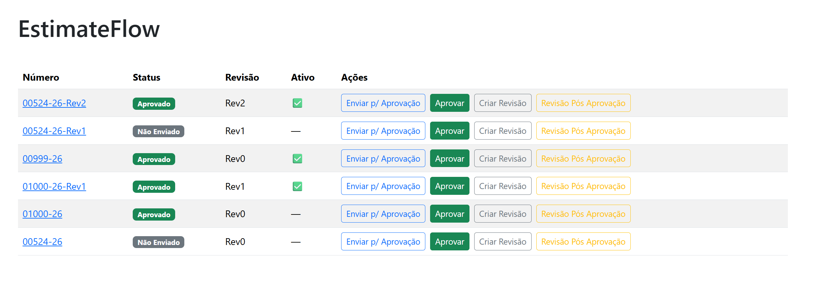
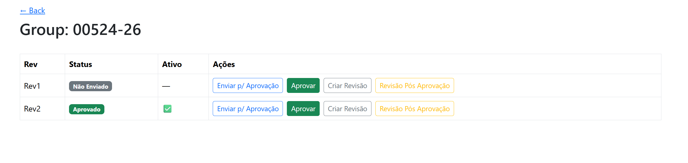

# EstimateFlow (Django) — Budgets, Revisions & Approval Workflow

A production-like Django project showcasing:
- Budget/Estimate **revisioning** (Rev0, Rev1, Rev2...)
- **Single active revision per group**
- **Approval workflow** with valid state transitions
- **Audit trail** (who changed what and when)
- **HTMX** interactions (partial updates, actions panel)

---

## Tech Stack
- Django
- HTMX + Bootstrap
- pytest + pytest-django
- SQLite (dev/demo)
- (Optional later) PostgreSQL + Docker

---

## Key Business Rules
- Revisions belong to a group (`orcamento_original`)
- Only one revision can be active per group (`is_ativo=True`)
- A revision can be created in two modes:
  - **Normal**: starts as `"Não Enviado"`
  - **Post-approval**: starts as `"Aprovado"` and keeps approval metadata

---

## Demo data
This repo includes a seed command that creates realistic scenarios:
- `00524-26` — **Não Enviado**
- `00999-26` — **Aguardando Aprovação**
- `01000-26` — **Aprovado** + `Rev1` (post-approval example)

---

## Run locally

## Screenshots

### List view


### Group detail (revisions)


### HTMX demo (no page reload)


### 1) Create virtualenv + install deps
```bash
python3 -m venv .venv
source .venv/bin/activate
pip install -U pip
pip install django django-filter pytest pytest-django factory-boy

2) Migrate + seed + run

cd src
python manage.py migrate
python manage.py seed_demo
python manage.py runserver 0.0.0.0:8000

Open: http://localhost:8000/

Login:

user: demo
pass: demo1234

Tests

python -m pytest -q


